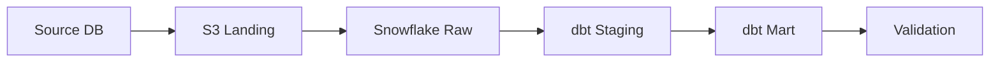

# 3부. VSCode 확장 설치 및 문서관리 설정하기

이번 장에서는 프로젝트 문서관리를 위해 VSCode 확장을 설치하고, 각 확장이 어떤 역할을 하는지 확인합니다.

이번 장의 핵심은 다음입니다.

```text
VSCode는 프로젝트 전체를 관리한다.
Markdown 문서는 VSCode에서도 편집한다.
Todo Tree로 미결사항을 추적한다.
GitLens로 변경 이력을 확인한다.
Excel Viewer로 표 문서를 확인한다.
```

---

## 1. 이번 장의 목표

이번 장을 완료하면 아래 기능을 사용할 수 있습니다.

| 기능 | 사용하는 확장 |
| --- | --- |
| Markdown 문서 작성 편의 | Markdown All in One |
| Mermaid 다이어그램 미리보기 | Markdown Preview Mermaid Support |
| Excalidraw 도면 편집 | Excalidraw |
| Draw.io 도면 편집 | Draw.io Integration |
| Excel/CSV 확인 | Excel Viewer |
| TODO/ISSUE/RISK 태그 추적 | Todo Tree |
| Git 변경 이력 확인 | GitLens |

---

## 2. VSCode에서 프로젝트 열기 확인

먼저 WSL 터미널에서 프로젝트 루트로 이동합니다.

```bash
cd ~/workspace/gsr-migration-ai-pl
code .
```

VSCode 왼쪽 아래에 아래처럼 표시되어야 합니다.

```text
WSL: Ubuntu
```

이 상태에서 확장을 설치해야 WSL 환경 안에서 제대로 동작합니다.

---

## 3. 추천 확장 목록

프로젝트에는 `.vscode/extensions.json` 파일을 두어 팀원에게 추천 확장을 자동으로 안내합니다.

파일 위치:

```text
.vscode/extensions.json
```

내용 예시는 다음과 같습니다.

```json
{
  "recommendations": [
    "yzhang.markdown-all-in-one",
    "bierner.markdown-mermaid",
    "pomdtr.excalidraw-editor",
    "hediet.vscode-drawio",
    "GrapeCity.gc-excelviewer",
    "Gruntfuggly.todo-tree",
    "eamodio.gitlens"
  ]
}
```

VSCode에서 이 프로젝트를 열면 추천 확장 설치 안내가 표시될 수 있습니다.

---

## 4. 확장별 용도 한눈에 보기

| 확장 | 주요 용도 | PL 문서관리에서 쓰는 곳 | 추천도 |
| --- | --- | --- | --- |
| Markdown All in One | Markdown 작성 편의 기능 | README, 회의록, 설계서, 보고서 작성 | 매우 높음 |
| Markdown Preview Mermaid Support | Mermaid 다이어그램 미리보기 | 간단한 흐름도, 의존관계, 전환 프로세스 표현 | 높음 |
| Excalidraw | 손그림 스타일 도면 작성 | 설명용 아키텍처, 전환 흐름, 회의 설명 자료 | 높음 |
| Draw.io Integration | 정형 다이어그램 작성 | 공식 아키텍처, 시스템 구성도, 데이터 흐름도 | 높음 |
| Excel Viewer | Excel/CSV 파일 조회 | WBS, 매핑표, 검증표, 이슈 목록 확인 | 높음 |
| Todo Tree | TODO/ISSUE/RISK 태그 추적 | 회의록과 설계서의 미결사항 추적 | 매우 높음 |
| GitLens | Git 변경 이력 확인 | 누가, 언제, 어떤 문서를 바꿨는지 확인 | 매우 높음 |

---

## 5. 확장 설치 방법 1: VSCode UI에서 설치

VSCode에서 다음 순서로 설치합니다.

```text
Extensions 아이콘 클릭
        ↓
검색창에 확장명 입력
        ↓
Install 클릭
```

설치할 확장은 다음과 같습니다.

```text
Markdown All in One
Markdown Preview Mermaid Support
Excalidraw
Draw.io Integration
Excel Viewer
Todo Tree
GitLens
```

WSL 환경에서는 확장 설치 위치가 중요합니다.

확장 화면에서 아래와 같은 표시가 있을 수 있습니다.

```text
Install in WSL: Ubuntu
```

이 버튼이 보이면 WSL 쪽에 설치합니다.

---

## 6. 확장 설치 방법 2: 명령어로 설치

VSCode가 WSL에서 정상 연결되어 있다면 아래 명령으로 설치할 수 있습니다.

```bash
code --install-extension yzhang.markdown-all-in-one
code --install-extension bierner.markdown-mermaid
code --install-extension pomdtr.excalidraw-editor
code --install-extension hediet.vscode-drawio
code --install-extension GrapeCity.gc-excelviewer
code --install-extension Gruntfuggly.todo-tree
code --install-extension eamodio.gitlens
```

설치된 확장 확인:

```bash
code --list-extensions | grep -E "markdown-all-in-one|markdown-mermaid|excalidraw|vscode-drawio|gc-excelviewer|todo-tree|gitlens"
```

예상 출력:

```text
yzhang.markdown-all-in-one
bierner.markdown-mermaid
pomdtr.excalidraw-editor
hediet.vscode-drawio
GrapeCity.gc-excelviewer
Gruntfuggly.todo-tree
eamodio.gitlens
```

---

## 7. VSCode 설정 파일 확인

프로젝트에는 `.vscode/settings.json` 파일을 둡니다.

파일 위치:

```text
.vscode/settings.json
```

추천 설정은 다음과 같습니다.

```json
{
  "files.eol": "\n",
  "files.trimTrailingWhitespace": true,
  "files.insertFinalNewline": true,

  "markdown.extension.toc.levels": "2..6",

  "todo-tree.general.tags": [
    "TODO",
    "FIXME",
    "ISSUE",
    "RISK",
    "CHECK",
    "QUESTION",
    "DECISION",
    "FOLLOWUP"
  ],
  "todo-tree.tree.showCountsInTree": true,
  "todo-tree.highlights.enabled": true,

  "gitlens.currentLine.enabled": true,
  "gitlens.hovers.currentLine.over": "line"
}
```

이 설정의 의미는 다음과 같습니다.

| 설정 | 의미 |
| --- | --- |
| `files.eol` | 줄바꿈을 LF로 통일 |
| `trimTrailingWhitespace` | 줄 끝 공백 제거 |
| `insertFinalNewline` | 파일 마지막 줄바꿈 추가 |
| `markdown.extension.toc.levels` | Markdown 목차 수준 설정 |
| `todo-tree.general.tags` | Todo Tree가 찾을 태그 정의 |
| `gitlens.currentLine.enabled` | 현재 줄의 Git 작성자 정보 표시 |

---

## 8. Todo Tree 동작 확인하기

Todo Tree는 문서 안에 있는 특정 태그를 전체 프로젝트에서 찾아줍니다.

샘플 회의록 파일을 엽니다.

```text
docs/08_meetings/weekly/2026-05-27_weekly_meeting.md
```

파일 안에 아래와 같은 내용이 있다고 가정합니다.

```markdown
# 2026-05-27 주간회의

## 논의 내용

고객사 제공 테이블 목록과 실제 DB 스키마가 일부 불일치함.

DECISION: 1차 개발은 확정 테이블 기준으로 우선 진행
TODO: 고객사에 최신 테이블 목록 재요청
CHECK: 실제 DB 스키마와 제공 목록 비교 필요
RISK: 매핑 확정 지연으로 개발 일정 지연 가능
```

VSCode 왼쪽 Activity Bar에서 Todo Tree 아이콘을 클릭합니다.

정상이라면 아래 태그들이 보입니다.

```text
DECISION
TODO
CHECK
RISK
```

---

## 9. Todo Tree 태그 사용 규칙

프로젝트에서는 아래 태그를 표준으로 사용합니다.

| 태그 | 의미 | 예시 |
| --- | --- | --- |
| `TODO` | 해야 할 일 | `TODO: 고객사에 증분 기준 컬럼 확인 요청` |
| `FIXME` | 수정 필요 | `FIXME: 검증 기준 설명 보완 필요` |
| `ISSUE` | 발생한 문제 | `ISSUE: 일부 테이블 PK 기준 불명확` |
| `RISK` | 발생 가능 위험 | `RISK: Full Load 시간이 배치 윈도우 초과 가능` |
| `CHECK` | 확인 필요 | `CHECK: 최신 테이블 목록과 실제 DB 비교 필요` |
| `QUESTION` | 질의 필요 | `QUESTION: 대사 기준에 금액 합계 포함 여부 확인` |
| `DECISION` | 결정 사항 | `DECISION: 1차 개발은 확정 테이블 기준 진행` |
| `FOLLOWUP` | 후속 조치 | `FOLLOWUP: 다음 주간회의에서 검증 기준 재확인` |

---

## 10. GitLens 동작 확인하기

GitLens는 Git 변경 이력과 작성자 정보를 보기 쉽게 해줍니다.

먼저 Git 저장소가 초기화되어 있어야 합니다.

```bash
cd ~/workspace/gsr-migration-ai-pl
git status
```

초기 커밋이 없다면 먼저 커밋합니다.

```bash
git add .
git commit -m "Initial PL documentation workspace"
```

그다음 파일 하나를 수정합니다.

예를 들어:

```text
docs/002_PROJECT_DASHBOARD.md
```

아래 내용을 추가합니다.

```markdown
TODO: 이번 주 주요 마일스톤 업데이트
```

저장한 뒤 VSCode Source Control 또는 GitLens에서 변경 파일을 확인합니다.

확인할 수 있는 항목은 다음입니다.

| 기능 | 설명 |
| --- | --- |
| File History | 파일 변경 이력 확인 |
| Line Blame | 특정 줄을 누가 언제 수정했는지 확인 |
| Compare Changes | 이전 버전과 현재 버전 비교 |
| Commit Details | 커밋에 포함된 변경 내용 확인 |

---

## 11. Excel Viewer 확인하기

Excel Viewer는 VSCode에서 Excel 또는 CSV를 빠르게 확인할 때 사용합니다.

테스트용 CSV 파일을 하나 만들어봅니다.

```bash
mkdir -p data/table_inventory

cat > data/table_inventory/source_table_list.csv <<'EOF'
system,schema,table_name,migration_type,owner,status
DB2,FIN,CUSTOMER,FULL,홍길동,확정
DB2,FIN,ACCOUNT,INCREMENTAL,김철수,검토중
DB2,FIN,TRANSACTION,INCREMENTAL,이영희,미확정
EOF
```

VSCode에서 아래 파일을 엽니다.

```text
data/table_inventory/source_table_list.csv
```

Excel Viewer가 설치되어 있으면 표 형태로 볼 수 있습니다.

단, Excel Viewer는 복잡한 Excel 작업을 대체하는 도구가 아닙니다.

| 용도 | 적합 여부 |
| --- | --- |
| CSV 빠른 확인 | 적합 |
| 간단한 Excel 조회 | 적합 |
| 복잡한 수식 편집 | 부적합 |
| 피벗/매크로 작업 | Excel 사용 권장 |
| 다중 사용자 동시 편집 | 별도 협업 도구 권장 |

---

## 12. Markdown All in One 확인하기

Markdown 문서에서 제목을 작성합니다.

```markdown
# 프로젝트 대시보드

## 현재 상태

## 이번 주 작업

## 주요 이슈

## 주요 리스크

## 다음 주 계획
```

명령 팔레트를 엽니다.

```text
Ctrl + Shift + P
```

아래 명령을 실행합니다.

```text
Markdown All in One: Create Table of Contents
```

문서에 목차가 자동 생성되는지 확인합니다.

---

## 13. Mermaid Preview 확인하기

Markdown 파일에 Mermaid 코드를 작성합니다.

예시 파일:

```text
docs/03_architecture/data_flow.md
```

내용 예시:

````markdown
# Data Flow


````

Markdown Preview를 엽니다.

```text
Ctrl + Shift + V
```

Mermaid 다이어그램이 렌더링되는지 확인합니다.

---

## 14. Excalidraw와 Draw.io 사용 기준

두 확장은 모두 도식화에 사용하지만 역할을 나누는 것이 좋습니다.

| 구분 | Excalidraw | Draw.io |
| --- | --- | --- |
| 스타일 | 손그림, 설명용 | 정형, 공식 문서용 |
| 적합한 용도 | 회의 설명, 아이디어 정리 | 아키텍처, 데이터 흐름, 시스템 구성도 |
| 파일 예시 | `.excalidraw` | `.drawio` |
| PL 활용 | 초안/설명 | 공식 산출물 |

추천 기준:

```text
아이디어를 빠르게 설명할 때 → Excalidraw
공식 산출물로 제출할 때 → Draw.io
```

예시 위치:

```text
docs/03_architecture/diagrams/migration_pipeline.excalidraw
docs/03_architecture/diagrams/target_architecture.drawio
```

---

## 15. Git 상태 확인 및 커밋

이번 장에서 테스트 파일을 만들었다면 Git 상태를 확인합니다.

```bash
git status
```

변경사항을 확인합니다.

```bash
git diff
```

문제가 없으면 커밋합니다.

```bash
git add .
git commit -m "Configure VSCode documentation extensions"
```

GitLens에서 방금 만든 커밋이 보이는지 확인합니다.

---

## 16. 이번 장 실습 결과 확인

아래 항목을 확인합니다.

| 항목 | 확인 방법 | 기대 결과 |
| --- | --- | --- |
| VSCode 확장 | Extensions 패널 | 7개 추천 확장 설치 |
| Todo Tree | Activity Bar | TODO, RISK, CHECK 등 표시 |
| GitLens | GitLens 패널 | 파일 히스토리, 변경 이력 표시 |
| Excel Viewer | CSV 열기 | 표 형태로 표시 |
| Markdown Preview | `Ctrl + Shift + V` | Mermaid 렌더링 |
| Git 상태 | `git status` | 변경사항 확인 또는 clean |

---

## 17. 자주 발생하는 문제

### 17.1 Todo Tree에 태그가 안 보임

확인할 것:

```text
.vscode/settings.json에 태그가 등록되어 있는가?
파일이 저장되어 있는가?
Todo Tree 패널을 새로고침했는가?
```

필요 시 VSCode를 재시작합니다.

---

### 17.2 GitLens가 동작하지 않음

확인할 것:

```text
현재 폴더가 Git 저장소인가?
git init을 했는가?
최소 1회 commit이 있는가?
VSCode가 WSL Remote로 열려 있는가?
```

확인 명령:

```bash
git status
git log --oneline
```

---

### 17.3 Excel Viewer가 CSV를 표로 열지 않음

VSCode에서 파일을 오른쪽 클릭한 뒤 다음을 선택합니다.

```text
Open With...
```

그다음 Excel Viewer 또는 CSV Preview 관련 항목을 선택합니다.

---

### 17.4 Mermaid가 보이지 않음

확인할 것:

```text
Markdown Preview Mermaid Support 설치 여부
코드블록 언어가 mermaid인지 확인
Markdown Preview로 열었는지 확인
```

올바른 형식:

````markdown

````

---

## 18. 이번 장 핵심 정리

이번 장에서 기억할 내용은 다음입니다.

```text
Markdown All in One = Markdown 작성 편의
Markdown Preview Mermaid Support = Markdown 다이어그램 미리보기
Excalidraw = 설명용 도면
Draw.io Integration = 공식 도면
Excel Viewer = 표 파일 확인
Todo Tree = 미결사항 태그 추적
GitLens = 변경 이력 추적
```

PL 문서관리 관점에서 우선순위는 다음입니다.

```text
1. Markdown All in One
2. Todo Tree
3. GitLens
4. Excel Viewer
5. Draw.io Integration
6. Excalidraw
7. Markdown Preview Mermaid Support
```

다음 장에서는 **4부. Obsidian을 docs 폴더와 연동하기**를 진행합니다.
